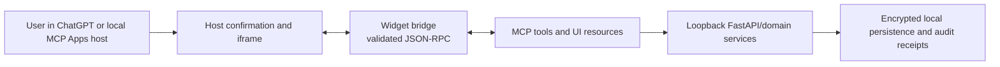

# Widget UI architecture

Issue: #22
Status: implementation-ready design for #23–#26

## Decision

Build the widget as an **Apps SDK web component** backed by the existing MCP
server. Apps SDK apps use an MCP server for tools and may provide a web
component rendered in a ChatGPT iframe; the resulting UI follows the MCP Apps
standard and can run in compatible hosts. [Apps SDK quickstart](https://developers.openai.com/apps-sdk/quickstart)

Use TypeScript with `strict: true`, React, Vite, Vitest, Testing Library, and
the Apps SDK UI design system where it provides an accessible component or
design token. The Apps SDK UI system is optional, but it is designed to produce
accessible components consistent with ChatGPT. [Apps SDK UI guidelines](https://developers.openai.com/apps-sdk/concepts/ui-guidelines)

This issue creates no runtime code or dependencies. #23 owns the scaffold,
dependency review, build pipeline, and bridge implementation.

## Deployment boundary

The current product is local-first: FastAPI binds to loopback and the MCP
server runs over stdio. The initial widget therefore targets an MCP
Apps-compatible local host that launches the stdio server. It does not expose
the local API through a public tunnel and does not turn the product into a
hosted service.

A future public ChatGPT connection is a separate product/security decision. It
would require an HTTPS MCP resource server and an OAuth 2.1 flow for
customer-specific data, rather than reusing the local bearer credential.
[Apps SDK authentication](https://developers.openai.com/apps-sdk/build/auth)

## Repository layout

```text
widget/
  package.json                 # #23: pinned UI dependencies and scripts
  tsconfig.json                # strict TypeScript
  vite.config.ts
  src/
    main.tsx                   # custom-element entry point
    bridge.ts                  # validated MCP Apps JSON-RPC bridge
    contracts.ts               # zod schemas and UI view models
    app.tsx                    # route/state composition
    components/                # accessible, shared presentational components
    views/                     # profile, jobs, match, compensation, application
    styles/                    # token-based styles; no third-party trackers/fonts
  tests/
    bridge.test.tsx
    views/*.test.tsx
```

`app/mcp_server.py` remains the tool boundary. #23 will register the built
widget as an MCP UI resource and associate it only with the tools that return
the corresponding structured content. The UI may not call FastAPI directly.

## Trust and authentication model



- The iframe receives only the structured data required to render the current
  view. It never receives `LOCAL_ACCESS_TOKEN`, an OpenAI key, a database URL,
  or a reusable authorization header.
- `bridge.ts` accepts messages only from the parent host, validates JSON-RPC
  shape and payloads with runtime schemas, and invokes an allowlisted tool.
- MCP/FastAPI remain authoritative for authentication, ownership, validation,
  legal state transitions, idempotency, and audit records. Client state is
  disposable presentation state, not a source of approval.
- The component must render job text, resumes, evidence, errors, and model
  output as text. It must not use `dangerouslySetInnerHTML`.
- Apps SDK widgets run in a sandboxed iframe with a strict CSP; #23 will use a
  minimal resource CSP and will not request external fetch or frame domains
  without a privacy review. [Apps SDK security and privacy](https://developers.openai.com/apps-sdk/guides/security-privacy)

## Tool and view contract map

All bridge data is schema-validated in `widget/src/contracts.ts`. Existing
Pydantic schemas remain the server contract; the UI duplicates only the fields
it renders.

| User journey | Existing tool/API | Widget view and allowed action | Contract gap / owner |
| --- | --- | --- | --- |
| Create profile | `create_candidate_profile` / `POST /profiles` | Start card; submit resume text and optional LinkedIn text; show generated profile summary. | Existing tool output is sufficient for #24. |
| Review profile | `review_candidate_profile` / `GET /profiles/{id}/review` | Read-only profile, evidence, ambiguities, and correction history. | Existing tool output is sufficient for #24. |
| Correct profile | `correct_candidate_profile` / `PATCH /profiles/{id}` | Editable review form; enabled only after a direct confirmation control. | Existing tool already has `confirmed_by_user`; #24 must preserve it. |
| Find jobs | `find_jobs` / `POST /jobs/search` | Search form and job results using current Greenhouse/Lever inputs only. | #25; source/filter expansion remains #17. |
| Match and compensation | `evaluate_job_match`, `estimate_market_compensation` | Selected job detail with read-only score, gaps, rationale, and compensation assumptions. | #25. |
| Prepare application | `prepare_job_application` / `POST /applications/prepare` | Read-only prepared-package summary, then application review. | #26 needs an application-read tool so a reopened widget can reload a package. |
| Resolve screening question | HTTP endpoint exists; no MCP tool | Direct user-entered answer with a confirmation control and category/reason display. | #26 must add a narrow approval-gated MCP tool and schema. |
| Approve application | HTTP endpoint exists; no MCP tool | Explicit, visually distinct approval confirmation and approved receipt. | #26 must add a narrow MCP tool; no submission action. |
| Download resume | HTTP endpoint exists; no MCP tool | A host-safe download action after package review. | #26 must design a resource/tool response that avoids exposing the bearer credential. |

No client route or tool may submit, upload to an employer, message a third
party, withdraw, accept, or decline an application. Those capabilities remain
out of scope until #20 has an approved design and implementation.

## Information architecture and display modes

The widget uses conversation-native inline cards for a single result or simple
decision, and a fullscreen view for multi-step review. This follows the Apps
SDK guidance to keep inline cards lightweight, avoid deep navigation, and use
at most two primary actions. [Apps SDK UI guidelines](https://developers.openai.com/apps-sdk/concepts/ui-guidelines)

| Surface | Purpose | Primary content | Actions |
| --- | --- | --- | --- |
| Inline profile card | Show a generated/reviewed profile status | Name, headline, ambiguity count, evidence count | `Review profile`, optional `Correct` |
| Inline job card | Summarize one selected job | Company, title, location, freshness, match status | `Inspect match`, `Prepare application` |
| Inline match/compensation card | Summarize a decision aid | Overall score, gaps, range, confidence | `Open details` |
| Fullscreen review workspace | Support rich, multi-step workflows | Section navigation: Profile, Jobs, Match, Compensation, Application | Back, explicit page-local action only |
| Inline approval receipt | Confirm a completed approval only | Application ID, approved state, unresolved count zero | `View package` |

The fullscreen workspace does not contain an assisted-apply or submission
control. It exposes the following navigation sequence:

```text
Profile review -> Jobs -> Job detail -> Match and compensation ->
Prepare package -> Application review -> Sensitive confirmations -> Approval receipt
```

Every view provides `loading`, `empty`, `error`, and `ready` states. Errors are
short, actionable, and mapped without internal stack traces:

| Server result | UI treatment |
| --- | --- |
| `400` | Identify the invalid bounded field; keep unsent local form input. |
| `401` / `403` | Show connection/authorization status; do not retry with a token. |
| `404` | Explain that the selected local record is unavailable; offer safe navigation back. |
| `409` | Show the current state conflict, especially unresolved screening requirements. |
| `429` | Disable the repeated action and show a retry-after status when supplied. |
| `503` / network failure | Mark the operation incomplete, retain no approval claim, and offer a bounded retry. |

## Approval and confirmation interaction

Preparation is read-only and never implies submission. The application view
has three distinct states:

1. **Prepared** — resume, cover letter, warnings, and unresolved questions are
   reviewable; no approval has occurred.
2. **Needs direct input** — sensitive screening questions show their category
   and reason. The user must type the answer and activate a labelled direct
   confirmation before the narrow resolution tool is called.
3. **Ready to approve / Approved** — approval is enabled only when the server
   reports no unresolved requirements. A confirmation dialog names the local
   application package and says explicitly that approval is not submission.

The confirmation control disables while a request is in flight and requires a
fresh server response before it reports success. The widget must not infer,
prefill, or cache sensitive answers. Server-side validation and audit receipts
remain mandatory even after UI confirmation. This follows the Apps SDK
guidance to validate inputs server-side and require human confirmation for
irreversible operations. [Apps SDK security and privacy](https://developers.openai.com/apps-sdk/guides/security-privacy)

## Accessibility and responsive requirements

- Use semantic headings, landmarks, buttons, forms, labels, and native focus
  order. Avoid clickable non-button containers.
- Every async outcome uses a concise `aria-live` status; validation errors are
  programmatically associated with their fields.
- On narrow widths, fullscreen review becomes one column with persistent page
  title and a non-modal section picker. Inline cards never require nested
  scrolling.
- The visible label, programmatic label, and confirmation effect must agree.
- Keyboard use must cover search, selection, corrections, sensitive-answer
  confirmation, approval, dialogs, and return focus after a dialog closes.
- Color is never the sole carrier of approval state, warnings, or errors.

## Child issue delivery order

1. **#23** implements the approved runtime, resource registration, bridge,
   runtime schemas, shell, responsive primitives, and test setup.
2. **#24** implements profile review/correction using the profile contracts.
3. **#25** implements search, job, match, and compensation views without
   broadening providers beyond #17.
4. **#26** adds the missing narrow MCP contracts and the application
   review/screening/approval view; it must prove submission remains absent.
5. **#11** closes only after the children satisfy the original end-to-end,
   desktop/mobile, review, and approval criteria.
6. **#20** remains downstream and requires a separate approved assisted-apply
   design.

## Validation for the design

- Confirm all referenced Python paths and endpoint/tool names exist.
- Review this design against `tests/test_api_workflow.py`, the local-only
  authentication model in `README.md`, and the screening/approval rules in
  `AGENTS.md`.
- Run `git diff --check` before commit. No application tests are required for
  this documentation-only issue.
